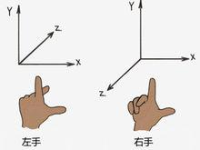
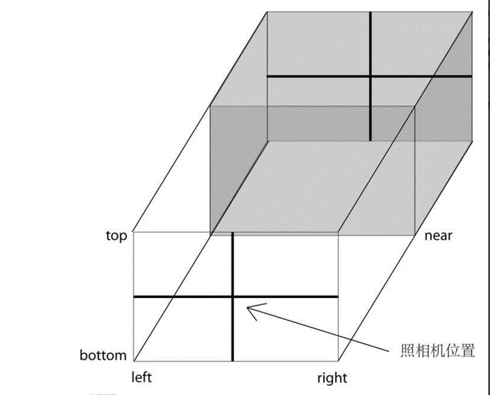
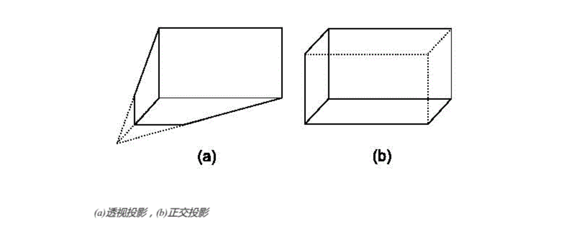

## three-learning
自己关于three.js的入门学习整理, 项目地址: [https://winterzhao.github.io/three-example](https://winterzhao.github.io/three-example)

Three.js 里面的基础概念包括 场景(舞台scene)、照相机(camera)、光源(light)、物体(object)等几部分组成。整个渲染思路理解: 我们将物体"画"在场景里,使用光源改变它的既视效果,将调整好的"画面"排成照片，传给渲染器。渲染器和DOM元素绑定,将收到的图片渲染到网页上。这一流程不停循环，就用到了动画。

重要: 所有颜色都统一使用0xFF0000，这种十六进制大写补全6位的格式。

### 目录结构
* [理论](#theory)
* [demo](#demo)
* [常用loaders](#loaders)
* [example](#example)
* [其他资源](#resource)

#### 理论
* 基础概念
  * [opengl](#opengl)
  * [webgl](#webgl)
  * [three.js](#three.js)
  * [坐标系](#coordinate-system)
  * [RGB光的反射原理和减色法](#reflect)
  * [动画](#animation)

* three.js基础概念
  * [渲染器](#renderer)
  * [场景](#scene)
  * [照相机](#camera)
  * [光源](#light)
  * [几何形状](#geometry)
  * [材质/纹理](#material)
  * [物体](#mesh)

* 其他资源
  * [性能监控器](state)

###### opengl
opengl: Open Graphics Library, 是用于渲染2D、3D矢量图形的跨语言、跨平台的应用程序编程接口,是硬件(显卡)对外提供绘制从简单的图形比特到复杂的三维景象的一系列统一的、普遍可用的规范API(标明其所需要的能力)。硬件厂商依赖于规范开发实现对应的功能能力,而上层应用则直接调用对应的接口API实现应用。

###### webgl
一种3D绘图网络标准，它使用HTML5Canvas并允许利用文档对象模型接口，允许把JavaScript和OpenGL ES 2.0结合在一起，通过增加OpenGL ES 2.0的一个JavaScript绑定，WebGL可以为HTML5 Canvas提供硬件3D加速渲染。

###### three.js
three.js是JavaScript编写的WebGL第三方库,用以实现webGl所支持的2D、3D绘图能力。

###### coordinate-system
坐标系: three.js默认使用的是右手坐标系,需要重点记住x,y,z轴的方向 [重要]

###### reflect
 RGB光的反射原理和减色法: 减色法是物体表面反射光线的原理， 减色法能让我们看见周围物体的色彩，譬如：一个绿球，在白光中出现绿色是因为此球吸收红、蓝波长，而反射出绿色。当然，若光源中只发出红、蓝光（或是品红光），此球将出现黑色，因为绿球上没有绿波长可反射出来。

 当没有任何光源的时候，无论物体的本来颜色是什么，显示在屏幕上的颜色永远是黑色。在场景中没有任何光源的情况下，物体不能反射光源到人的眼里，所以物体应该是黑色的,即使物体的本来颜色是红色的,这与物体的材质颜色几乎没有关系。

 反射光计算: 
  * 例1：如果光源为000000，那么不管什么材质，颜色都是000000，因为没有光（RGB）进入材质，也就不存在光被过滤的情况，所以看到是黑色。
  * 例2：如果光源为红色FF0000，材质为888888，光源经过材质过滤，因为R色FF比88强，而材质最强只能反射88的R光，多余的R光会被材质吸收掉，而光源中G和B根本就没，所以材质不会存在G和B光，即呈现880000
  * 例3：如果光源为888888，材质为FF0000，因光源R部分比材质弱，即使材质吸收G光的能力为0，所以反射的R光为88，同理GB被材质吸收，反射00，最后呈现880000
  * 结论：呈现颜色=材质颜色+光源颜色的并集（即取小），即FF0000 U 888888 = 880000
  * RGB色取拆分后，再取各自的：并集

###### animation
* 动画: 
  * 当物体在快速运动时,当人眼所看到的影像消失后，人眼仍能继续保留其影像1/24秒左右的图像，这种现象被称为视觉暂留现象。是人眼具有的一种性质。人眼观看物体时，成像于视网膜上，并由视神经输入人脑，感觉到物体的像。一帧一帧的图像进入人脑，人脑就会将这些图像给连接起来，形成动画。
  * 动画主要三部分: 移动、缩放，旋转。
* 帧数：在3D世界里，经常使用帧数的概念来评估一个3D的性能,图形处理器每秒钟能够刷新几次，通常用fps(Frames Per Second)(FPS表示：上一秒的帧数)来表示,帧数越高，画面的感觉就会越好。所以大多数游戏都会有超过30的FPS。

* 取消动画: cancelAnimationFrame, 有兼容性问题

      let requestAnimationFrame = window.requestAnimationFrame || window.mozRequestAnimationFrame || window.webkitRequestAnimationFrame || window.msRequestAnimationFrame
      window.requestAnimationFrame = requestAnimationFrame

###### renderer
渲染器:

###### scene
场景/舞台: 

###### camera
照相机: 
  * 作用: 照相机确定三维场景如何在二维中显示的投影方式。
  * 照相机四要素: 种类(正交/透视)、位置、朝向、头方向(头朝上还是头朝下……)
  * 注意事项
    * 照相机的移动方向与场景的视觉移动方向相反。当将照相机向右移动时，页面上的效果看上去像是向左移动了。
    * lookAt的作用: 照相机默认是面向z轴负方向放置的, 当我们修改了照相机的位置时, 由于相机默认面向z轴负方向放置,很有可能导致照相机看不到任何东西，这时候需要调整照相机的朝向,lookAt的作用是改变照相机的朝向。
  * 视景体: 照相机的视线范围是有限的,只有在视线范围内的物体可以被看到，称为视景体,而视景体外的物体在显示前会被裁掉。
  * 阵列摄像机(ArrayCamera):一个 ArrayCamera 会包含多个子摄像机，通过这一组子摄像机渲染出实际效果，适用于 VR 场景
  * 正交相机(OrthographicCamera)
    * 特点: 长宽高等比例缩放到平面上。将物体所在三维空间的点一一对应到二维视图平面上的成像(远近高低比例都相同)
    * OrthographicCamera(left, right, top, bottom, near): 这六个参数分别代表正交投影照相机拍摄到的空间的六个面的位置,称为视景体,只有在视景体内部(下图中的灰色部分)的物体才可能显示在屏幕上，而视景体外的物体在显示前会被裁掉。
    * 正交相机视景体: 为了保持照相机的横竖比例,需要保证(right-left) 与(top-bottom)的比例与canvas的宽度与高度的比例一致。一般near会小一些，而far会更大一些。
    
  * 透视相机(PerspectiveCamera)
    * 特点: 视线等比例缩放到平面上。透视相机看到的效果: 类似于我们站在某个点上肉眼看到的效果，站在某点,将远方的效果以视线等比例的效果缩放到面前的平面上。 透视相机的效果就是近大远小的特点; 
    * perspectiveCamera(fov, aspect, near, far)
      * fov:竖直方向上的张角, 角度; 当fov变大的时候，我们看到的场景更大，相应的视景体在大场景中的视觉比例会变小。以人为一个点a,目视前方，看到的最高点与看到的最低点与a三者形成的夹角为fov。
      * aspect = width/height: 照相机水平方向和竖直方向长度的比值,通常设为canvas的横纵比例
      * near: 照相机到视景体最近的距离, 正值.
      * far: 照相机到视景体最远的距离，正值,大于near
  * 正交相机和透视相机的选择: 一般来说,对于制图、建模软件通常使用正交投影,这样不会因为投影而改变物体比例,而对于其他大多数应用，通常使用透视投影，这样更符合人眼的观察效果。
  

###### light
光源: 光源照射在物体上的反射效果及阴影效果对物体的展现有着极好的效果，因为有了光，世界变得丰富起来。
  * 分类:
    * 环境光(AmbientLight): 经过多次反射而来的光称为环境光，无法确定其最初的方向。环境光是一种无处不在的光。环境光源放出的光线被认为来自任何方向。因此，当你仅为场景指定环境光时，所有的物体无论法向量如何，都将表现为同样的明暗程度。从环境光的构造函数来看，它只有颜色，其位置对场景中的物体并没有影响，因为他是均匀的反射到物体的表面的。
    * 平行光/方向光(DirectionalLight): 是一组没有衰减的平行的光线，类似太阳光的效果, DirectionalLight(hex, intensity):颜色和强度;强度如果为0，表示光线基本没什么作用，那么物体就会显示为黑色。平行光的方向由位置和原点（0,0,0）来决定，方向光只与方向有关，与离物体的远近无关。所以修改光源的z值不会导致物体的颜色发生改变,修改x，y值会导致物体的颜色改变。
    * 聚光灯(SpotLight): 
      * 含义: 这种光源的光线从一个锥体中射出，在被照射的物体上产生聚光的效果。使用这种光源需要指定光的射出方向以及锥体的顶角α
      * SpotLight( hex, intensity, distance, angle, exponent )
        * Hex：聚光灯发出的颜色
        * Intensity：光源的强度，默认是1.0,
        * Distance：光线的强度，从最大值衰减到0，需要的距离,默认为0，表示光不衰减，如果非0，则表示从光源的位置到Distance的距离，光都在线性衰减。到离光源距离Distance时，光源强度为0.
        * Angle: 聚光灯着色的角度，用弧度作为单位，这个角度是和光源的方向形成的角度。
        * exponent：发散系数, 光源模型中，衰减的一个参数，越大衰减约快.
    * 点光源(PointLight):
      * 含义: 由这种光源放出的光线来自同一点，且方向辐射自四面八方。
      * PointLight( color, intensity, distance )
        * color: 颜色
        * intensity: 光的强度(0-1),
        * distance: 光的距离,从光源所在的位置，经过distance这段距离之后，光的强度将从Intensity衰减为0。 默认情况下，这个值为0.0，表示光源强度不衰减。
    * 区域光
  * 注意事项: 
    * 环境光通常使用白色或者灰色,作为整体光照的基础。
    * 在three.js中，能形成阴影的光源只有THREE.DirectionalLight与 THREE.SpotLight;而 相对地,能表现阴影效果的材质只有THREE.LambertMaterial与THREE.PhongMaterial
    * RGB光的反射原理与减色法(#reflect)
    
###### geometry
几何形状: 
  * buffergeometry相比geometry的优势: buffergeometry会缓存网格模型，这样当二次更新时直接修改缓存区模型，而不用重新转化数据
  * 种类:
    * BoxGeometry: [四边形几何体](https://threejs.org/docs/index.html#api/zh/geometries/BoxGeometry)
    * CircleGeometry: [二维圆形几何体/八边形](https://threejs.org/docs/index.html#api/zh/geometries/CircleGeometry)
    * ConeGeometry: [圆锥几何体](https://threejs.org/docs/index.html#api/zh/geometries/ConeGeometry)
    * CylinderGeometry:[圆柱几何体](https://threejs.org/docs/index.html#api/zh/geometries/CylinderGeometry)
    * SphereGeometry:[球体/球的一部分](https://threejs.org/docs/index.html#api/zh/geometries/SphereGeometry) 
    * RingGeometry:[圆环几何体/八卦](https://threejs.org/docs/index.html#api/zh/geometries/RingGeometry)
    * ShapeGeometry:[心形](https://threejs.org/docs/index.html#api/zh/geometries/ShapeGeometry)
    * TextGeometry:[文本几何体](https://threejs.org/docs/index.html#api/zh/geometries/TextGeometry)
    * TorusGeometry:[圆环几何体/车轮](https://threejs.org/docs/index.html#api/zh/geometries/TorusGeometry)

###### material
材质/纹理: 
  * 材质: 材质决定了物体表面上看起来像什么
  * 纹理: 纹理以一定的规则映射到几何体上，一般是三角形上，那么这个几何体就有纹理皮肤了.3D引擎中,首先应该有一个纹理类，其次是有一个加载图片的方法，将这张图片和这个纹理类捆绑起来。在threejs中，纹理类由THREE.Texture表示:THREE.Texture( image, mapping, wrapS, wrapT, magFilter,minFilter, format, type, anisotropy )
    * Image: 先通过var image = THREE.ImageUtils.loadTexture(url);  加载远程图片,然后赋给Image
    * Mapping:THREE.UVMapping()类型，它表示的是纹理坐标,
    * wrapS:表示x轴的纹理的回环方式，就是当纹理的宽度小于需要贴图的平面的宽度的时候，平面剩下的部分应该p以何种方式贴图的问题;
    * wrapT: 表示y轴的纹理回环方式
    * magFilter: 过滤的方式
    * minFilter: 过滤的方式
    * format: 表示加载的图片的格式，这个参数可以取值THREE.RGBAFormat，RGBFormat等。THREE.RGBAFormat表示每个像素点要使用四个分量表示，分别是红、绿、蓝、透明来表示。RGBFormat则不使用透明，也就是说纹理不会有透明的效果
    * type: 表示存储纹理的内存的每一个字节的格式，是有符号，还是没有符号，是整形，还是浮点型。不过这里默认是无符号型（THREE.UnsignedByteType）。
    * anisotropy: 各向异性过滤。使用各向异性过滤能够使纹理的效果更好，但是会消耗更多的内存、CPU、GPU时间，
  *  MeshLambertMaterial: 只考虑漫反射，而不考虑镜面反射的效果，因而对于金属、镜子等需要镜面反射效果的物体不适用，对于其他大部分物体的漫反射效果都是适用的。
    * color: 表现材质对散射光的反射能力;
    * emissive: 材质的自发光颜色，可以用来表现光源的颜色。
  * MeshPhongMaterial材质: 考虑了镜面反射的效果，因此对于金属、镜面的表现尤为适合。
    * color: 表现材质对散射光的反射能力;
    * emissive: 材质的自发光颜色，可以用来表现光源的颜色。
    * specular: 镜面反射系数
    * shininess: 高亮的程度,越高的值越闪亮;默认值30;

###### mesh
物体: 物体由几何形状(或者加载物)与材质/纹理决定的;集合形状/加载物决定物体的形状,材质、纹理与光照决定物体的视觉效果。

###### state
性能监控器(stats):
  * 当FPS足够大(比如达到60),再增加帧数人眼也不会感受到明显的变化,反而相应地要消耗更多资源，因此，选择一个适中的FPS即可，一般FPS在30-60之间都是可取的。
  * 默认three.js没有设置具体的FPS,而是使用requestAnimationFrame,它告诉浏览器在合适的时候调用指定函数，通常可能达到60FPS
  * 如果你需要设置具体的FPS，可以考虑使用setInterval来实现。
  * setInterval和requestAnimationFrame的效果区别: 一般没区别，但当浏览器达不到设定的调用周期时,requestAnimationFrame会跳帧,而requestAnimationFrame则会卡顿，但是每一帧都会绘制出来。

###### dat.gui
轻量级的icon形用户界面框架,可以通过icon用户界面修改改变对应函数的熟悉，动态看到效果. [使用教程](http://www.hangge.com/blog/cache/detail_1785.html)

###### tween.js
[tween.js动画曲线](https://www.zhangxinxu.com/study/201612/how-to-use-tween-js.html)

#### loaders
位于loaders下
* BinaryLoader
* objLoader
* vtkLoader
目前只有objLoader验证成功.

#### demo
1. [单例模式基础模板和说明](./demo/base.html): 介绍场景(舞台scene)、照相机(camera)、光源(light)、物体(object)基本概念 [done]
2. [绘制多种几何图形](./demo/geometry.html): 介绍几种常见几何体的画法 [done]
3. 动画
  * [动画与性能监控器、辅助标尺](./demo/animation.html): 旋转、移动、缩放动画与性能监控器、辅助标尺的使用 [done]
  * [绕自身旋转、绕轴旋转、绕某点旋转](./demo/rotate.html):物体实质上都是绕本身的中心点旋转的,可以通过修改自身的中心点(position)调整物体旋转的能力 [done]
  * [three与tween.js](./demo/three-tween.html)    [done]
4. [加载3d模型](./demo/load-3d.html)    [done]
5. [dat.gui使用](./demo/dat-gui.html);   [done]
6. [事件触发与碰撞检测](./demo/event.html)
7. [与vr结合](./demo/vr.html);
8. [与音频结合](./demo/video.html)  [done]

#### example

#### resource
1. [three.js官网](https://threejs.org/)
2. [three.js 入门指南](https://max.book118.com/html/2017/0627/118339258.shtm)
3. [Threejs基础教程](http://www.hewebgl.com/article/articledir/1)
4. [Three.js事件控制](http://blog.csdn.net/u014658748/article/details/51074840)
5. [3D 物理世界 - Three.js 与 Cannon.js 介绍与使用](https://www.codercto.com/a/33760.html)

